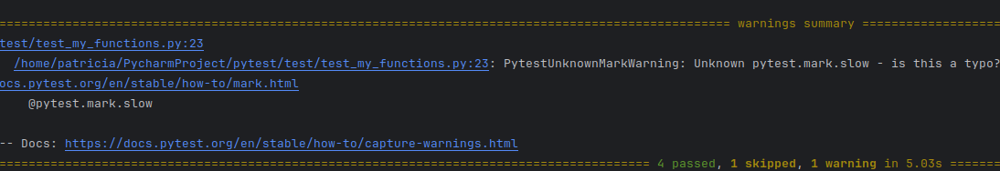
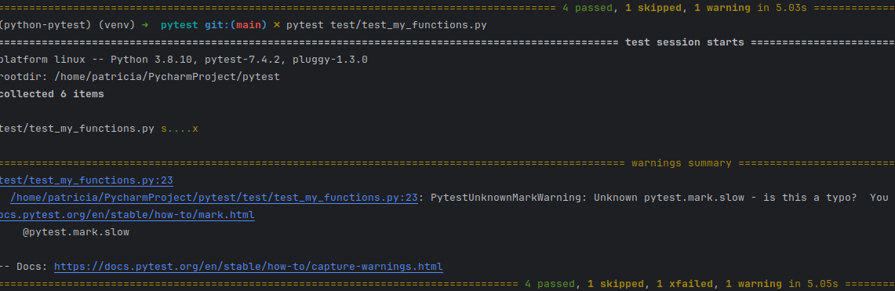
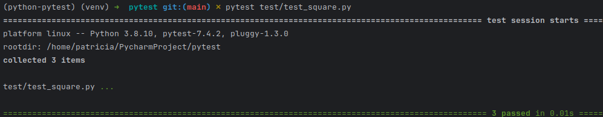

# pytest_freecodecamp
- [1.- Install Pytest y crear conjunto de carpetas](#schema1)
- [2.- Primera prueba](#schema2)
- [3.- Class-based Test](#schema3)
- [4.- Fixtures](#schema4)
- [5. Mark & Parametrize](#schema5)
- [6. Mocking](#schema6)


<a name="schema1"></a>

# 1. Install Pytest y crear conjunto de carpetas
``` 
pip install pytest 
``` 
- Crear carpeta source, donde van a ir el archivo con las fuciones a testear
  - Creamos un archivo my_functiones, donde añadimos dos funciones de prueba
  
    ```
    def add(number_one, number_two):
    return number_one + number_two

    def divide(number_one, number_two):
    return number_one/number_two
    ``` 
- Crear carpeta test, donde ve a ir el archivo para testear.
  - Dentro de esta carpeta creamos el archivo test_my_functions.py
  ```
  import pytest
  import source.my_functions as my_functions

  def test_add():
    pass
  ```
  - Y lo ejecutamos: 
    ```
    pytest test/test_my_functions.py
    ``` 
    Y comprobamos la salida, en este caso es una prueba y pasa correctamente.


<a name="schema2"></a>

# 2. Primera prueba.

Cambiamos el archivo `test_my_functions.py
```
  def test_add():
    result = my_functions.add(number_one=1, number_two=4)
    assert result == 5

```
Haciendo esto vemos que la función suma funciona correctamente.
Si cambiamos el valor que afirmamos que debaría de dar a 6, quedando así la función:
```
  def test_add():
    result = my_functions.add(number_one=1, number_two=4)
    assert result == 6

```
En este caso si que da un error


En caso de la division tenemos que tener en cuenta la division por 0, que aunque nosotros forcemos a que pase el codigo 
nos da error.
```
  def test_divide_by_zero():
    result = my_functions.divide(number_one=10, number_two=0)
    assert True
```


Pero si esperamos un division por zero
```
 def test_divide_by_zero():
    with pytest.raises(ZeroDivisionError):
        my_functions.divide(number_one=10, number_two=0)
```
Y ahora si que pasan los 3 test correctament


<a name="schema3"></a>

# 3. Class-based Test
- 1 Creamos el archivo `shapes.py` en la carpeta source. Con una clase shape y creamos una clase círculo
```
import math

class Shape:
    def area(self):
        pass
    def perimeter(self):
        pass

class Circle(Shape):
        def __init__(self,radius):
            self.radius = radius

        def area(self):
            return math.pi * self.radius ** 2

        def perimeter(self):
            return 2*math.pi *self.radius
```
- 2 Creamos el archivo de test `test_circle.py`, es bueno que el archivo de test tenga un nombre con el que podamos
saber a que archivo le va hacer test.
```
import pytest
import source.shapes as shapes

class TestCircle:
    def test_one(self):
        assert True
```


- 3 Creamos dos funciones nuevas, `setup_method` y `teardown_method`.
  - La primera se ejecuta antes de que comience la prueba y se usa para realizar configuraciones o preparaciones antes 
de una prueba
  - La segunda se ejecuta una después que se ejecute la prueba y se utiliza por lo general para realizar limpieza o 
liberar recursos después de que las pruebas se hayan ejecutado.
  ```
    import source.shapes as shapes
    import math


  class TestCircle:

    def setup_method(self,method):
        print(f'Setting up {method}')
        self.circle = shapes.Circle(10)

    def teardown_method(self,method):
        print(f'Tearing down {method}')
        del self.circle

    def test_area(self):
        assert self.circle.area() == math.pi * self.circle.radius ** 2

    def test_perimeter(self):
        result = self.circle.perimeter()
        expected = 2 * math.pi * self.circle.radius
        assert result == expected
  ```
- 4 Para ver la ejecución de estas dos útlimas funciones usamos 
  ```
    pytest test/test_circle.py -s
  ```
  


<a name="schema4"></a>

# 4. Fixtures
- 1 Creamos otra clase, `Rectangle` dentro del archivo shapes
```
class Rectangle(Shape):
    def __init__(self,length,width):
        self.length = length
        self.width = width
        
    def area(self):
        return self.length * self.width
    
    def perimeter(self):
        return (self.length * 2 ) + (self.width * 2)

```
- 2 Creamos un archivo test, `test_rectangle.py`.
```
import pytest
import source.shapes as shapes
import math

def test_area():
    rectangle = shapes.Rectangle(length=10, width=20)
    assert rectangle.area() == 10 * 20

def test_perimeter():
    rectangle = shapes.Rectangle(length=10, width=20)
    assert rectangle.perimeter() == (2*10) + (2*20)

```
Primer test pasado


Pero como vemos generamos dos rectángulos, para cambiarlo vamos a usar python fixtures.
Quedando así el código. Con esto estamos creando un rectangulo que vamos a usar en las dos funciones siguientes.
```
@pytest.fixture
def my_rectangle():
    return shapes.Rectangle(length=10, width=20)


def test_area(my_rectangle):
    assert my_rectangle.area() == 10 * 20


def test_perimeter(my_rectangle):
    assert my_rectangle.perimeter() == (2*10) + (2*20)

```


Para no tener muchas fixtures vamos a crear un archivo llamado `conftest.py` donde vamos a definir nuestros rectángulos.
Quitando las líneas de `test_rectagle.py` y añadiéndolas al `conftest.py`.

```
@pytest.fixture
def my_rectangle():
    return shapes.Rectangle(length=10, width=20)


@pytest.fixture
def weird_rectangle():
    return shapes.Rectangle(length=5, width=6)

```
Ejecutamos el y pasa correctamente  ya que las fixtures son globales. Para probar esto, añadimos a `test_circle.py`:
```
    def test_not_same_area_rectangle(self,my_rectangle):
        assert self.circle.area() != my_rectangle.area()

```
Y comrpobamos que sin añadar nada más la ejecución es correcta.

<a name="schema5"></a>

# 5. Mark & Parametrize
- ## Mark
El marcado en pytest se refiere a la capacidad de etiquetar o marcar pruebas para clasificarlas o personalizar su
comportamiento.

Vamos a usar los archivos `my_functions.py` y `test_my_functions.py`.

Para este caso vamos a usar `mark.slow`, que se usar para marcar una prueba como lenta. Es útil para identificar y 
manejar pruebas que consumen más tiempo que las pruebas típicas.
Añadimos:

```
import time


@pytest.mark.slow
def test_very_slow():
    time.sleep(5)
    result = my_functions.divide(number_one=10, number_two=5)
    assert result == 2

```

Paramos ver el resultado esos 5 segundos.

Ahora probamos `skip`, para optimizar la ejecución de ciertas pruebas.

```
@pytest.mark.skip(reason="This feature is currently broken")
def test_add():
    assert my_functions.add(number_one=1,number_two=2) == 3
```


Xfail, se usa cuando una prueba se espera que falle, pero queremos que se ejecute y registre el resultado de la prueba.
Esta funcionalidad es útil en situacines donde una parte de tu código está rota o no funcionas como se espera, pero aún 
deseas ejecutar otras partes de tus pruebas sin que se la prueba marcada como "esperada para fallar" cause una 
interrupción.

```
@pytest.mark.xfail(reason="We know we cannot divide by zero")
def test_divide_zero_error_broken():
    my_functions.divide(number_one=4,number_two=0)
```


- ## Parametrize
Es un decorador que se utiliza para parametrizar pruebas, lo que significa que te permite ejecutar una misma prueba
con diferentes conjutnso de datos de entrada y esperar resultaados. Esto es especialmente útli cuando tienes una serie 
de pruebas que siguen un patrón similar, pero se deben probar con diferentes valores.

Vamos a usar los archivos `shape.py` y `test_square.py`.
- Al archivo `shape.py` le vamos a añadir una nueva clase.
```
class Square(Rectangle):

    def __init__(self,side_lenght):
        super().__init__(side_lenght,side_lenght)
```
- Y creamos el archivo `test_square.py`. La lista de tuplas proporciona diferentes valores de entrada `(side_length)` y
los resultados esperados `(expected_area)`, se ejecutará la prueba para cada conjunto de datos proporcionando y
comprobará si el resultado coincide con el valor esperado.
```
import pytest
import source.shapes as shapes


@pytest.mark.parametrize("side_length, expected_area", [(5, 25), (4, 16), (9, 81)])
def test_multiple_square_areas(side_length, expected_area):
    assert shapes.Square(side_length).area() == expected_area
```



Como podemos ver hay 3 puntos que son las tres tuplas que hemos evaluado.


<a name="schema6"></a>

# 6. Mocking

En esta parte vamos a crear objetos simulados (mocks) que actúen como funciones o métodos específicos. Esto te permite
controlar lo que una función o método devuelve y cómo se comporta en una prueba sin necesidad de acceder a componontes
externos o hacer llamadas a APIs reales. Por ejemplo, se puede simular una base de datos o una API web.

Creamos un archivo nuevo `service.py` donde vamos a crear una base de datos dummy.
## Base de datos, mock
- 1º Creamos una base de datos dummy
```
database = {
    1: "Alice",
    2: "Bob",
    3: "Charlie"
}

```

- 2º Creamos las funciones necesarias.
```
def get_user_from_db(user_id):
    return database.get(user_id)
```
- 3º Creamos el archivo `test_service.py`, donde creamos una función mock para testear.
Lo primero que hace este código es reemplazar temporalmente una función o método en el código en este caso reemplazamos
source.service.get_user_from_db por mock_get_user_from_db.

mock_get_user_from_db.return_value = 'Mocked Alice': Aquí estás configurando el comportamiento del objeto 
mock mock_get_user_from_db. Cuando la función get_user_from_db se llame durante la prueba, en lugar de ejecutar el 
código real de source.service.get_user_from_db, se retornará el valor 'Mocked Alice'. Esto simula el comportamiento 
esperado de la función en esta prueba.

user_name = service.get_user_from_db(1): Estás llamando a la función get_user_from_db desde el módulo service, 
que suponemos utiliza source.service.get_user_from_db. Sin embargo, debido al decorador @mock.patch, 
en realidad se está utilizando el objeto mock mock_get_user_from_db en lugar de la función real.

assert user_name == 'Mocked Alice': Finalmente, estás verificando que el resultado de llamar a get_user_from_db con el 
argumento 1 sea igual a 'Mocked Alice', que es el valor configurado previamente en el objeto mock. 
Si la prueba es exitosa, esto confirma que la función get_user_from_db en realidad se ha reemplazado por el mock y 
que el código en service está utilizando el valor simulado.

```
import pytest
import source.service as service
import unittest.mock as mock

@mock.patch("source.service.get_user_from_db")
def test_get_user_from_db(mock_get_user_from_db):
    mock_get_user_from_db.return_value = 'Mocked Alice'
    user_name = service.get_user_from_db(1)
    assert user_name == 'Mocked Alice'
```

## API, mock

Instalamos librería requests
```
pip install requests

```

Añadimos este código a `service.py`, donde obtenemos unos datos mock de esa página.
```
def get_users():
    reponse = requests.get('https://jsonplaceholder.typicode.com/users')
    if reponse.status_code == 200:
        return response.json()

    raise requests.HTTPError
```

Y en `test_service.py`, añadimos esto.
```
@mock.patch("requests.get")
def test_get_users(mock_get):
    mock_response = mock.Mock()
    mock_response.status_code = 200
    mock_response.json.return_value = {"id": 1, "name": "John Doe"}
    mock_get.return_value = mock_response
    data = service.get_users()
    assert data == {"id": 1, "name": "John Doe"}

```