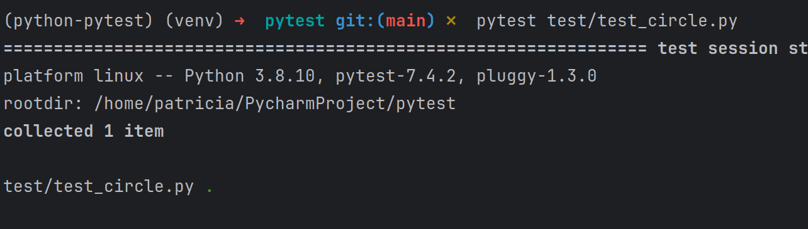
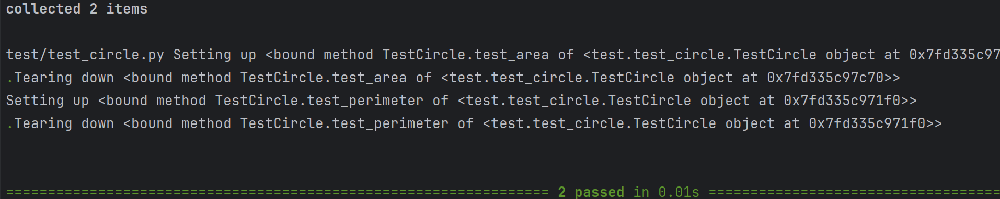
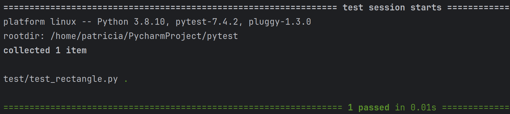

# pytest_freecodecamp
- [1.- Install Pytest y crear conjunto de carpetas](#schema1)
- [2.- Primera prueba](#schema2)
- [3.- Class-based Test](#schema3)
- [4.- Fixtures](#schema4)


<a name="schema1"></a>

# 1. Install Pytest y crear conjunto de carpetas
``` 
pip install pytest 
``` 
- Crear carpeta source, donde van a ir el archivo con las fuciones a testear
  - Creamos un archivo my_functiones, donde añadimos dos funciones de prueba
  
    ```
    def add(number_one, number_two):
    return number_one + number_two

    def divide(number_one, number_two):
    return number_one/number_two
    ``` 
- Crear carpeta test, donde ve a ir el archivo para testear.
  - Dentro de esta carpeta creamos el archivo test_my_functions.py
  ```
  import pytest
  import source.my_functions as my_functions

  def test_add():
    pass
  ```
  - Y lo ejecutamos: 
    ```
    pytest test/test_my_functions.py
    ``` 
    Y comprobamos la salida, en este caso es una prueba y pasa correctamente.


<a name="schema2"></a>

# 2. Primera prueba.

Cambiamos el archivo `test_my_functions.py
```
  def test_add():
    result = my_functions.add(number_one=1, number_two=4)
    assert result == 5

```
Haciendo esto vemos que la función suma funciona correctamente.
Si cambiamos el valor que afirmamos que debaría de dar a 6, quedando así la función:
```
  def test_add():
    result = my_functions.add(number_one=1, number_two=4)
    assert result == 6

```
En este caso si que da un error


En caso de la division tenemos que tener en cuenta la division por 0, que aunque nosotros forcemos a que pase el codigo 
nos da error.
```
  def test_divide_by_zero():
    result = my_functions.divide(number_one=10, number_two=0)
    assert True
```


Pero si esperamos un division por zero
```
 def test_divide_by_zero():
    with pytest.raises(ZeroDivisionError):
        my_functions.divide(number_one=10, number_two=0)
```
Y ahora si que pasan los 3 test correctament


<a name="schema3"></a>

# 3. Class-based Test
- 1 Creamos el archivo `shapes.py` en la carpeta source. Con una clase shape y creamos una clase círculo
```
import math

class Shape:
    def area(self):
        pass
    def perimeter(self):
        pass

class Circle(Shape):
        def __init__(self,radius):
            self.radius = radius

        def area(self):
            return math.pi * self.radius ** 2

        def perimeter(self):
            return 2*math.pi *self.radius
```
- 2 Creamos el archivo de test `test_circle.py`, es bueno que el archivo de test tenga un nombre con el que podamos
saber a que archivo le va hacer test.
```
import pytest
import source.shapes as shapes

class TestCircle:
    def test_one(self):
        assert True
```


- 3 Creamos dos funciones nuevas, `setup_method` y `teardown_method`.
  - La primera se ejecuta antes de que comience la prueba y se usa para realizar configuraciones o preparaciones antes 
de una prueba
  - La segunda se ejecuta una después que se ejecute la prueba y se utiliza por lo general para realizar limpieza o 
liberar recursos después de que las pruebas se hayan ejecutado.
  ```
    import source.shapes as shapes
    import math


  class TestCircle:

    def setup_method(self,method):
        print(f'Setting up {method}')
        self.circle = shapes.Circle(10)

    def teardown_method(self,method):
        print(f'Tearing down {method}')
        del self.circle

    def test_area(self):
        assert self.circle.area() == math.pi * self.circle.radius ** 2

    def test_perimeter(self):
        result = self.circle.perimeter()
        expected = 2 * math.pi * self.circle.radius
        assert result == expected
  ```
- 4 Para ver la ejecución de estas dos útlimas funciones usamos 
  ```
    pytest test/test_circle.py -s
  ```
  


<a name="schema4"></a>

# 4. Fixtures
- 1 Creamos otra clase, `Rectangle` dentro del archivo shapes
```
class Rectangle(Shape):
    def __init__(self,length,width):
        self.length = length
        self.width = width
        
    def area(self):
        return self.length * self.width
    
    def perimeter(self):
        return (self.length * 2 ) + (self.width * 2)

```
- 2 Creamos un archivo test, `test_rectangle.py`.
```
import pytest
import source.shapes as shapes
import math

def test_area():
    rectangle = shapes.Rectangle(length=10, width=20)
    assert rectangle.area() == 10 * 20

def test_perimeter():
    rectangle = shapes.Rectangle(length=10, width=20)
    assert rectangle.perimeter() == (2*10) + (2*20)

```
Primer test pasado


Pero como vemos generamos dos rectángulos, para cambiarlo vamos a usar python fixtures.
Quedando así el código. Con esto estamos creando un rectangulo que vamos a usar en las dos funciones siguientes.
```
@pytest.fixture
def my_rectangle():
    return shapes.Rectangle(length=10, width=20)


def test_area(my_rectangle):
    assert my_rectangle.area() == 10 * 20


def test_perimeter(my_rectangle):
    assert my_rectangle.perimeter() == (2*10) + (2*20)

```


Para no tener muchas fixtures vamos a crear un archivo llamado `conftest.py` donde vamos a definir nuestros rectángulos.
Quitando las líneas de `test_rectagle.py` y añadiéndolas al `conftest.py`.

```
@pytest.fixture
def my_rectangle():
    return shapes.Rectangle(length=10, width=20)


@pytest.fixture
def weird_rectangle():
    return shapes.Rectangle(length=5, width=6)

```
Ejecutamos el y pasa correctamente  ya que las fixtures son globales. Para probar esto, añadimos a `test_circle.py`:
```
    def test_not_same_area_rectangle(self,my_rectangle):
        assert self.circle.area() != my_rectangle.area()

```
Y comrpobamos que sin añadar nada más la ejecución es correcta.