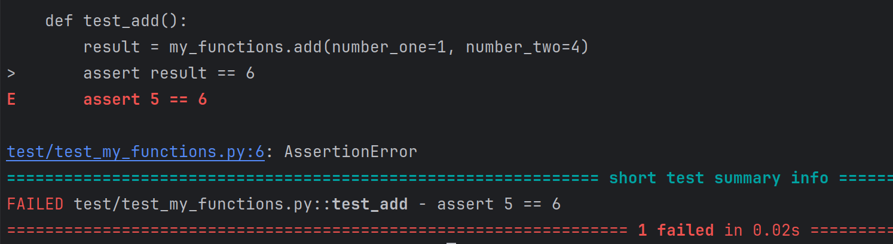
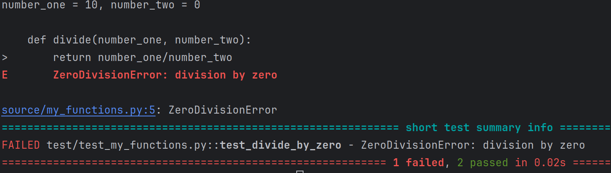
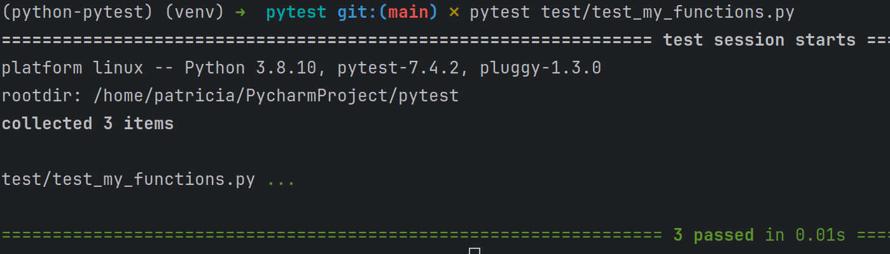

# pytest_freecodecamp
- [1.- Install Pytest y crear conjunto de carpetas](#schema1)
- [2.- Primera prueba](#schema2)
- [3.- Class-based Test](#schema3)


<a name="schema1"></a>

# 1. Install Pytest y crear conjunto de carpetas
``` 
pip install pytest 
``` 
- Crear carpeta source, donde van a ir el archivo con las fuciones a testear
  - Creamos un archivo my_functiones, donde añadimos dos funciones de prueba
  
    ```
    def add(number_one, number_two):
    return number_one + number_two

    def divide(number_one, number_two):
    return number_one/number_two
    ``` 
- Crear carpeta test, donde ve a ir el archivo para testear.
  - Dentro de esta carpeta creamos el archivo test_my_functions.py
  ```
  import pytest
  import source.my_functions as my_functions

  def test_add():
    pass
  ```
  - Y lo ejecutamos: 
    ```
    pytest test/test_my_functions.py
    ``` 
    Y comprobamos la salida, en este caso es una prueba y pasa correctamente.


<a name="schema2"></a>

# 2. Primera prueba.

Cambiamos el archivo `test_my_functions.py
```
  def test_add():
    result = my_functions.add(number_one=1, number_two=4)
    assert result == 5

```
Haciendo esto vemos que la función suma funciona correctamente.
Si cambiamos el valor que afirmamos que debaría de dar a 6, quedando así la función:
```
  def test_add():
    result = my_functions.add(number_one=1, number_two=4)
    assert result == 6

```
En este caso si que da un error


En caso de la division tenemos que tener en cuenta la division por 0, que aunque nosotros forcemos a que pase el codigo 
nos da error.
```
  def test_divide_by_zero():
    result = my_functions.divide(number_one=10, number_two=0)
    assert True
```



Pero si esperamos un division por zero
```
 def test_divide_by_zero():
    with pytest.raises(ZeroDivisionError):
        my_functions.divide(number_one=10, number_two=0)
```
Y ahora si que pasan los 3 test correctament


<a name="schema3"></a>

# 3. Class-based Test
- 1 Creamos el archivo `shapes.py` en la carpeta source